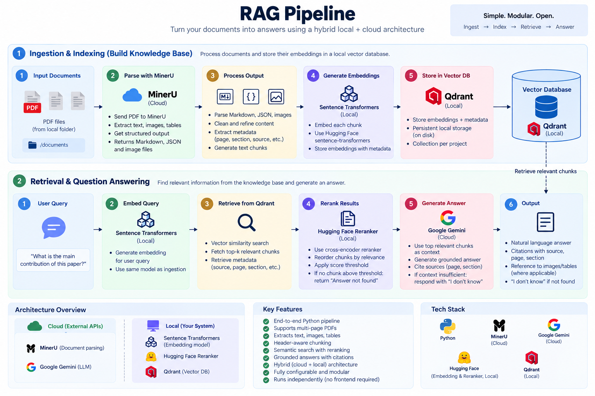

# RAG

RAG (Retrieval-Augmented Generation) is a library built using a **hybrid architecture**.

The architecture separates the heavier models from the lightweight components:

* **Cloud:** Runs heavier models such as the LLM and document parser.
* **Local:** Runs lightweight models such as the embedding and reranking models.
* **RAG Pipeline:** Provides the components required to build a complete RAG stack.

The goal is to provide a simple, modular foundation for building a RAG pipeline using **free and customizable models and services**.

## Model Overview

The models used by RAG can be configured from the `config.py` file. You can replace the default models with your own models according to your requirements.

| Model Type | Model Name              | Response Time  | Runs On |
| ---------- | ----------------------- | ------------:  | ------- |
| Parser     | MinerU                  |    ~20s / PDF  | Cloud   |
| Embedding  | BAAI/bge-m3             | ~4–7s / batch  | Local   |
| Reranker   | BAAI/bge-reranker-v2-m3 | ~4–10s / query | Local   |
| LLM        | Gemini 2.5 Flash-Lite   | ~3–7s / query  | Cloud   |

> **Note:** Response times are approximate and can vary significantly depending on several factors, including hardware, network latency, document size, number of chunks, chunk size, batch size, model configuration, and the number of retrieved documents. Actual performance may differ between systems and workloads.

## Pipeline Overview

The complete RAG pipeline is illustrated below:



## Usage

Before using the library, make sure to add your **MinerU API key** and **Google API key** to the `.env` file.

```env
MINERU_TOKEN=your_mineru_token
GOOGLE_API_KEY=your_google_api_key
```

### 1. Configure the Models

Update `config.py` to configure the models and services used by the RAG pipeline.

You can replace the default models with other compatible models according to your requirements.

### 2. Where Should I Place Documents?

Place your PDF documents in the configured documents directory.

For example:

```text
tests/
└── documents/
    ├── document1.pdf
    ├── document2.pdf
    └── document3.pdf
```

### 3. Run Individual Components

The individual RAG pipeline components can be run separately using `uv`:

```bash
uv run python src/rag/chunk.py
uv run python src/rag/ingestion.py
uv run python src/rag/retrieve.py
```

These commands allow you to run document chunking, ingestion, and retrieval independently.

## Full RAG Pipeline

The complete pipeline can be executed by combining document processing, ingestion, and retrieval.

```python
from pathlib import Path

from rag.chunk import documents_to_chunks
from rag.ingestion import ingestion_handler
from rag.retrieve import retrieve_answers

# Paths
source = Path("./tests/documents")
mineru_output_dir = Path("./outputs/mineru")
qdrant_output_dir = Path("./outputs/qdrant")

# Qdrant collection
collection_name = "documents"

# 1. Parse and chunk documents
documents_to_chunks(
    source,
    mineru_output_dir,
)

# 2. Generate embeddings and ingest into Qdrant
ingestion_handler(
    mineru_output_dir,
    qdrant_output_dir,
    collection_name,
)

# 3. Query the RAG pipeline
query = input("[RAG] Query: ").strip()

if not query:
    raise SystemExit("[RAG] Query cannot be empty")

response = retrieve_answers(query)

print(response.answer)
```
## Thanks

This project uses and is built upon:

- [MinerU](https://github.com/opendatalab/MinerU) - PDF parsing and document processing
- [MinerU API Management](https://mineru.net/apiManage/token) - MinerU API access
- [Qdrant](https://qdrant.tech/) - Vector database
- [Hugging Face](https://huggingface.co/) - Embedding and reranking models
- [MinerU KB Packager](https://github.com/frondesce/mineru-kb-packager) - Chunking and retrieval-ready processing of MinerU outputs
- [Google AI](https://aistudio.google.com/api-keys) - LLM API

## License

Add your license information here.
